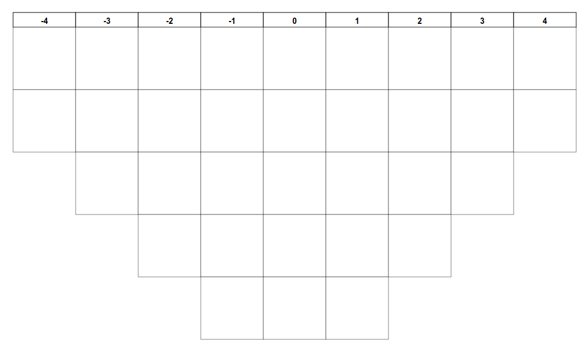
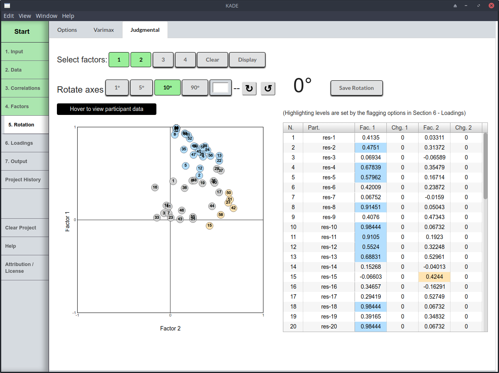
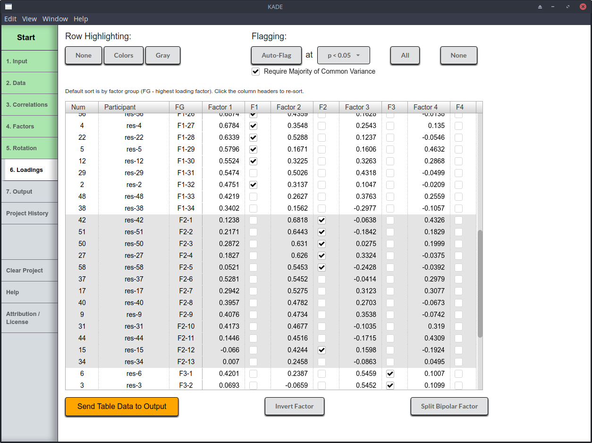
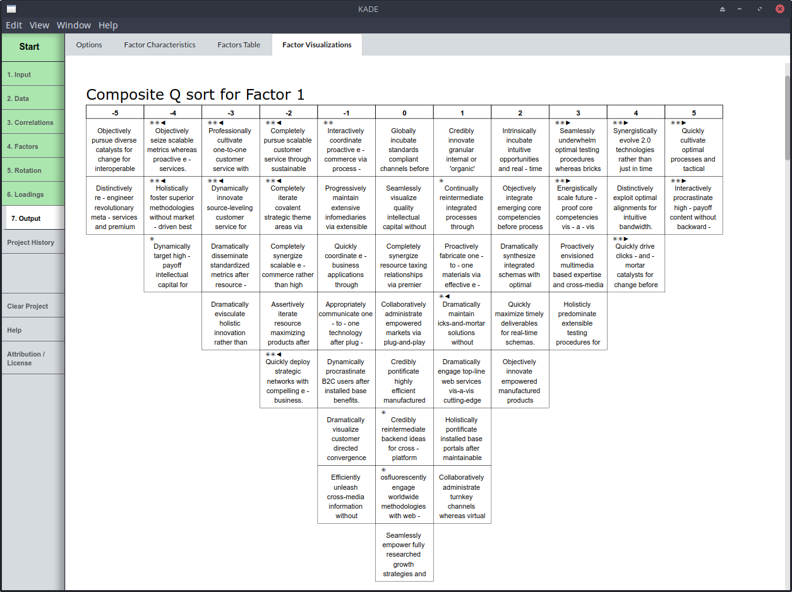

# Background

Q Methodology is an approach to understanding subjectivity that combines qualitative and quantitative techniques [@Brown:1996 Ramlo:2016]. Originally developed in the 1930s, it allows for a systematic investigation into the viewpoints or perspectives of the participants in the study [@Watts:2012]. A Q methodology study begins with the researcher assembling a set of statements related to the research topic. The statements are often drawn from participant interviews, but can also be derived from theories related to the research topic or other sources [@Brown:1996]. The participants in the study are asked to rank and sort the statements in accordance with a predefined grid pattern (Figure 1). If the participants feel that the statement aligns with their opinion they are asked to place it more to the right (positive) side of the grid, while if they disagree with it they should place it more to the left (negative) side.

**Figure 1**: Sample Q Sort Grid Pattern

The participant statement sort grids are analyzed using specialized software packages. After examining correlations of the statement sort grids, researchers conduct a centroid factor analysis or principal components analysis. Usually, the extracted factors or components are then rotated using a theory-based judgmental (manual) rotation or varimax rotation. In the final steps of the analysis the researcher uses the factor loadings to select representative participant sorts, which are then used to produce composite statement sort grids for each factor. The researcher combines these composite factors with interview data and other information to interpret the subjective viewpoints of the study participants [@Walker:2018].

# The KADE application

KADE is a desktop application for the analysis of Q methodology data which runs on Microsoft Windows, Apple macOS, and Linux operating systems. The goal of KADE is improve the analysis process by providing interactive visualizations that make it easer to manipulate and interpret the data gathered in a Q methodology study. For example, when researchers use centroid factor analysis the KADE judgmental rotation screen displays both a table of the factor loadings data and a scatter plot of the two factors being rotated (Figure 2).

**Figure 2**: Judgmental Rotation Screen

Participant loadings that are significant are automatically highlighted in the factor loadings table and the scatter plot, greatly facilitating decisions related to the rotation of the factors. Similarly, on the factor loadings screen KADE provides a table of the loadings with the participants automatically sorted according to the factor on which they have the highest loading (Figure 3).

**Figure 3**: Factor Loadings Screen

The output file from KADE provides the same data tables as the most commonly used application for Q methodology, PQMethod [@Schmolck:2014], but it also includes tables of the relative rankings of statements between factors. In addition, KADE generates visualizations of the composite factors to aid in the interpretation of the results (Figure 4). The visualizations can be exported from the application in either PNG or scalable vector graphics (SVG) format.

**Figure 4**: Composite Q Sort Visualization Screen

Future goals for the application include the addition of hierarchical factor structure tables and visualizations, which could help researchers to identify the appropriate number of factors to extract [@vanExel:2011], and the internationalization of the graphical user interface to make it easier for non-English speaking researchers to use the application.

# References
